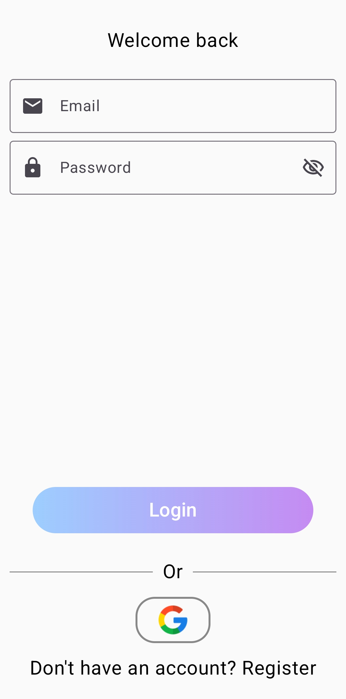
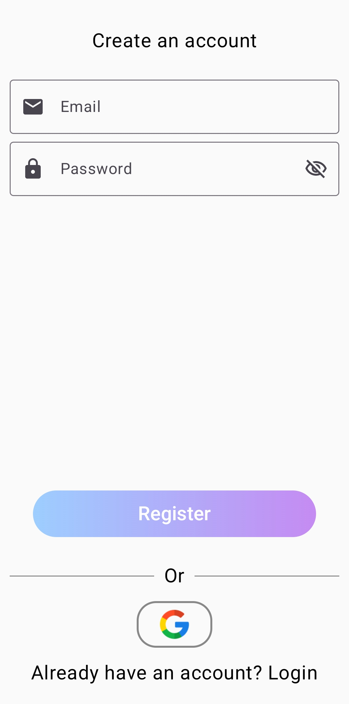
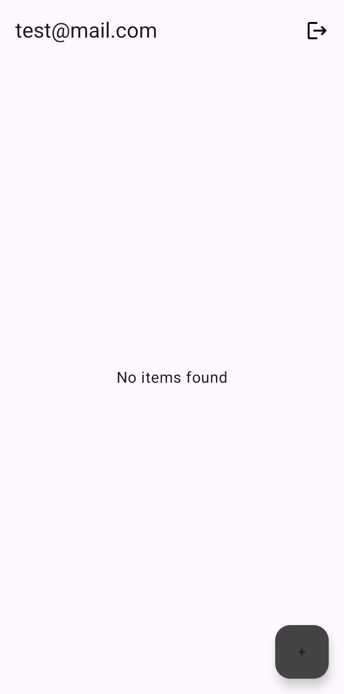
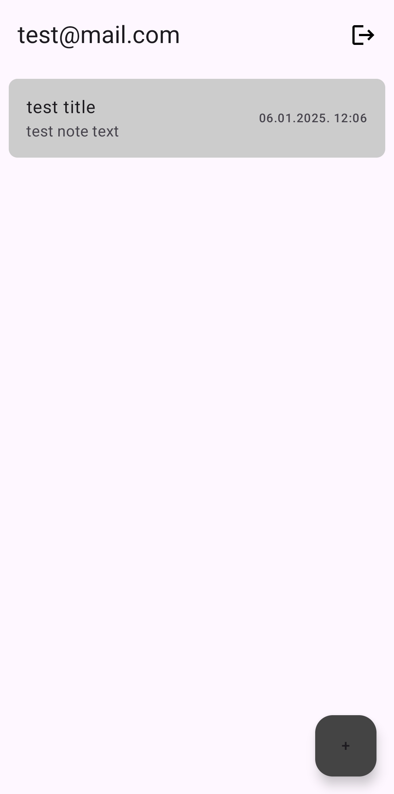

# Project info

Notes is in progress KMP application which targets are:
* Android
* iOS
* JVM (server)
* *JVM (desktop) - plan for the future*

# Tech stack & Open-source libraries
- Static analysis ([Ktlint](https://github.com/pinterest/ktlint) and [Detekt](https://github.com/detekt/detekt))
- CI/CD: [GitHub Actions](https://github.com/MatijaSokol/Notes/actions)
- [Arrow](https://arrow-kt.io/) for error handling
- [Firebase](https://firebase.google.com/docs/auth) for authentication
- [SQLDelight](https://sqldelight.github.io/sqldelight/2.0.2/): Typesafe Kotlin APIs for SQL database
- [Coroutines](https://github.com/Kotlin/kotlinx.coroutines) + [Flow](https://kotlinlang.org/docs/flow.html) for asynchronous
- [Koin](https://insert-koin.io/) for dependency injection
- [Ktor](https://ktor.io/) for networking (server + client)
- [Kotlinx Serialization](https://github.com/Kotlin/kotlinx.serialization) for data serialization

## Client (Android & iOS)
- Minimum SDK level 24 (Android)
- [Compose Multiplatform](https://www.jetbrains.com/compose-multiplatform/) for building shared UI
- [Multiplatform Navigation](https://www.jetbrains.com/help/kotlin-multiplatform-dev/compose-navigation-routing.html)
- [Shared Element Transition](https://developer.android.com/develop/ui/compose/animation/shared-elements)
- [Splash Screen](https://developer.android.com/develop/ui/views/launch/splash-screen)

## How to run
- Android - Find generated .apk file through [workflow](https://github.com/MatijaSokol/Notes/actions/workflows/distribute_release_prod_apk_artifact.yml) or trigger it to create new .apk
- iOS - Open project in Xcode and run it
- Server - Open project in IntelliJ IDEA and run it locally
  - Firebase credentials (retrieved from Firebase console) needs to be set up as environment variable `NOTES_FIREBASE_CREDENTIALS`
  - For client apps to communicate with server, `BASE_URL` should be configured correctly
    - For local server, `BASE_URL` should be in format `http://192.xxx.xxx.xx:[port]` (on macOS can be found via `ifconfig | grep 192`)
- Client app could be run without server in offline mode, only login should be done online
  - Test credentials: `test@mail.com`/`test123`

## Known issues
- iOS - Incorrect splash icon size
- iOS - Note update not working

## Screenshots
<table>
   <tr>
       <td>  </td>
       <td>  </td>
   </tr> 
   <tr>
       <td>  </td>
       <td>  </td>
   </tr> 
   <tr>
       <td>  </td>
   </tr> 
</table>